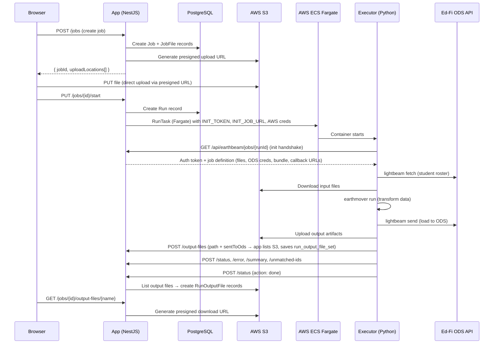
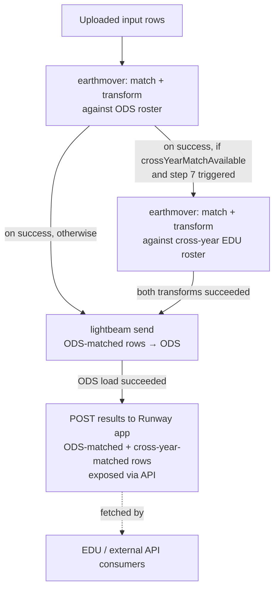

# Runway — AI Agent Context

> Context for AI coding assistants (Claude Code, Codex, Cursor, etc.). Update as the project evolves.

Runway is a UI for integrating K-12 education data to the [Ed-Fi](https://www.ed-fi.org/) standard, built on top of [earthmover](https://github.com/edanalytics/earthmover) (data transformation) and [lightbeam](https://github.com/edanalytics/lightbeam) (Ed-Fi API loading).

## Components

- **`app/`** — Node.js monorepo (NX workspace): NestJS backend + React frontend
- **`executor/`** — Python job executor (earthmover + lightbeam)
- **`cloudformation/`** — AWS deployment templates

## App Layout (`app/`)

```
app/
├── api/                # NestJS backend
│   ├── src/            # Application source
│   │   └── database/   # Prisma schema + Postgrator migrations
│   └── integration/    # Integration tests + helpers
├── fe/                 # React frontend
├── models/             # Shared TypeScript types
└── utils/              # Shared utilities
```

## Tech Stack

- **Frontend**: React 18, **Chakra UI v2** (custom tokens: `blue.50`, `pink.100`, `gray.50`, `green.100`), TanStack Router + Query, react-hook-form
- **Backend**: NestJS, Prisma ORM, PostgreSQL, Passport.js (OIDC for UI auth), [jose](https://github.com/panva/jose) (JWT for external API auth)
- **Build**: NX monorepo, TypeScript throughout `app/`
- **CI**: GitHub Actions — `.github/workflows/app_ci_pipeline.yml`

## Testing

### App tests (run from `app/`)

**Full suite — CI/local parity** (spins up a Dockerized test DB in CI and local runs):

```bash
npm run api:test
```

**Quick integration tests — local dev** (starts the test DB if needed, leaves it running):

```bash
npm run api:test:integration:local
```

**Typechecking:**

```bash
npm run api:typecheck
npm run fe:typecheck
```

## Database Migrations

Schema changes follow this workflow (all commands run from `app/`):

1. Write a SQL migration file in `app/api/src/database/postgrator/migrations/`
2. Present the SQL for review and get explicit user approval
3. Run `npm run api:migrate-local-dev` to apply the migration to the local dev DB
4. Run `npm run prisma:pull-and-generate` to introspect the DB and regenerate the Prisma schema + client
5. Verify the Prisma schema diff contains all and only the expected changes

**Do not edit `schema.prisma` directly** — it is generated from the database via `prisma:pull-and-generate`. The SQL migration is the source of truth.

Migrations run automatically at the start of the integration test suite. If tests fail with schema errors, a missing or mismatched migration is the likely cause.

## Architecture

### Deployed Infrastructure

- **App**: Elastic Beanstalk (EC2 + ALB), frontend on S3 + CloudFront
- **Executor**: ECS Fargate (3 task sizes: small/medium/large)
- **Database**: RDS PostgreSQL (private subnet)
- **Network**: VPC with public + private subnets across 2 AZs
- **CI/CD**: CodePipeline + CodeBuild → Beanstalk deploy + ECR push
- **Security**: WAF on ALB, IAM scoped roles, Secrets Manager
- **Monitoring**: CloudWatch dashboards + alarms, EventBridge → Slack via Lambda

### Job Execution Flow



### AWS Dependencies

| Service | Used By | Purpose |
|---|---|---|
| **S3** | App + Executor | File storage — presigned upload/download URLs, executor artifact I/O |
| **ECS Fargate** | App | Launches executor container |
| **STS** | App | Generates scoped temporary credentials for executor S3 access |
| **SSM Parameter Store** | App | ECS cluster/subnet/task definition config |
| **Secrets Manager** | App | Database credentials, app config |
| **EventBridge** | App | Run-completion notifications (Slack, etc.) |
| **ECR** | CI/CD | Executor Docker image registry |

### Key Files — AWS Touchpoints

- `app/api/src/files/file.service.ts` — S3 presigned URL generation
- `app/api/src/earthbeam/executor/executor.aws.service.ts` — ECS task launch, STS assume role
- `app/api/src/event-emitter/event-emitter.service.ts` — EventBridge notifications
- `app/api/src/config/app-config.service.ts` — Secrets Manager + SSM reads

### Key Files — App ↔ Executor Communication

- `app/api/src/earthbeam/api/earthbeam-api.controller.ts` — HTTP callback endpoints the executor calls
- `app/api/src/earthbeam/api/earthbeam-api.service.ts` — Job payload assembly, run completion
- `app/models/src/dtos/earthbeam-api.dto.ts` — Job payload shape
- `executor/executor/executor.py` — Main executor: S3 operations, HTTP callbacks, earthmover/lightbeam invocation

### Executor Lifecycle

1. **Init**: GET `INIT_JOB_URL` with `INIT_TOKEN` → receives auth token + job URL
2. **Job fetch**: GET job URL → full job definition (files, ODS creds, bundle, callback URLs)
3. **Bundle refresh**: git fetch/checkout/pull the earthmover bundle
4. **Roster fetch**: `lightbeam fetch` student roster from ODS, upload artifact to S3
5. **File download**: Download user-uploaded input files from S3
6. **Transform**: `earthmover run` against the ODS roster (with encoding detection + retry)
7. **Cross-year retry** (when `crossYearMatchAvailable` and the first pass produced unmatched students): GET `appUrls.roster` for the cross-year NDJSON roster, write to a `.jsonl` file, and re-run `earthmover` against it using the same ID type.
8. **Load**: `lightbeam send` to Ed-Fi ODS
9. **Report**: POST summary, unmatched IDs, errors to app via callback URLs
10. **Output files**: POST output file path + `sentToOds` flag to `/output-files` callback; app validates path, lists S3, saves `run_output_file_set`
11. **Done**: POST status `{action: DONE, status: success|failure}`

### Cross-Year Matching Flow

When cross-year matching runs, the executor progresses through each stage of processing for both rosters before moving on, to avoid mixed-status jobs (e.g., a file failing "insufficient matches" against the ODS roster but succeeding against the cross-year roster, when those matches really belonged in the ODS).



Cross-year-matched rows are never sent to the ODS — they're only made available through the Runway app's API, which EDU and other external consumers query.

### Roster sources & no-ODS year selectability

A roster is the student lookup the executor matches input rows against. Source precedence:

1. **ODS** — for `sendToOds` years, the executor fetches the roster from the ODS API.
2. **EDU** — for no-ODS (`sendToOds=false`) years, if `crossYearMatchAvailable`, the executor pulls the roster from EDU (Snowflake) via `appUrls.roster` as NDJSON. EDU is preferred over the S3 file when available (executor handles this; no executor change in PR 3).
3. **S3 roster file** — the fallback for no-ODS years when cross-year matching is unavailable (`__rosters/...jsonl`). The app omits `rosterFilePath` from the payload when `crossYearMatchAvailable` is true (it would be a dangling pointer).

A no-ODS year is **selectable** at job creation, and shows **green** ("roster loaded") on the ODS-config page, when a roster file exists **OR** the partner has cross-year matching enabled. This gate is the partner setting only (`crossYearMatchingEnabled`) — no creds/connection check, so a year can be selectable while the executor's `crossYearMatchAvailable` (which also requires `canConnect`) is false; that case fails cleanly at run time per run atomicity.

### S3 Path Structure

```
{partnerId}/{tenantCode}/{schoolYearId}/{jobId}/input/{templateKey}__{fileName}
{partnerId}/{tenantCode}/{schoolYearId}/{jobId}/output/{artifactFileName}
__rosters/{partnerId}/{tenantCode}/{schoolYearEndYear}/*
```

## Development Conventions

- **Commits**: lowercase subject + body explaining the "why"
- **API**: NestJS controller → service → repository pattern
- **Error handling**: Services return result objects (`{ status: 'SUCCESS', data }` / `{ status: 'ERROR', code }`) for expected failure modes; unexpected errors throw. Controllers map error results to HTTP exceptions. Services should not import or throw HTTP exceptions.
- **FE**: Chakra UI v2 with custom design tokens; prefer inline readable code over extracted helpers for short logic
- **Icons**: `app/fe/src/assets/icons/`
- **Data fetching and suspense**:
  - Critical data → `useSuspenseQuery` in the component, `ensureQueryData` in an ancestor loader.
  - Optional data → `useQuery` with a fallback value. Optionally `prefetchQuery` in a loader to warm the cache.
  - Never `useSuspenseQuery` on a query only reached via `prefetchQuery` — a failed prefetch will re-suspend.
  - Scope prefetches to the route that needs them, not `__root`.
  - Always `await` or `return` a prefetch from the loader — fire-and-forget won't warm the cache in time. Pair `prefetchQuery` with a soft fallback (`data ?? default`) in the component, since errored prefetches leave the cache empty.
  - Per-major-route pending/error UI via TanStack Router's `pendingComponent` and `errorComponent` (set on the section's parent route, e.g., `/ods-configs`). Route-level pending covers all sub-routes; the top-level React `<Suspense>` in `app.tsx` is only a safety net for unexpected suspends.
- **Documentation**: When changing behavior described in nearby docs (README.md, AGENTS.md, code comments), update the docs in the same commit. When creating a commit, review changed files for references to documentation and flag any that may need updating.
