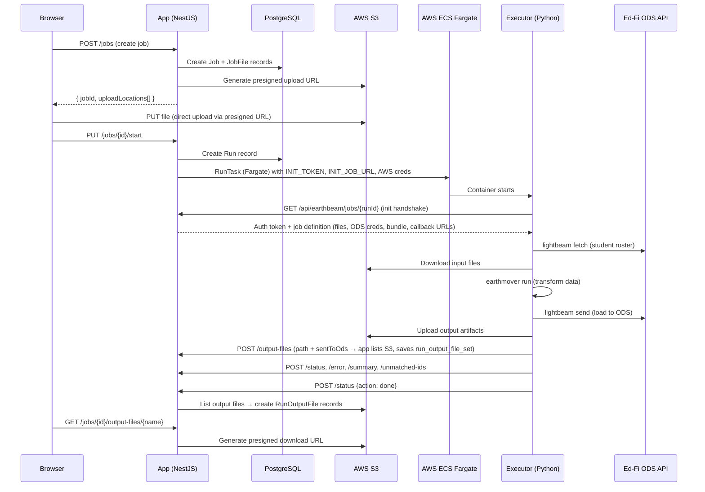
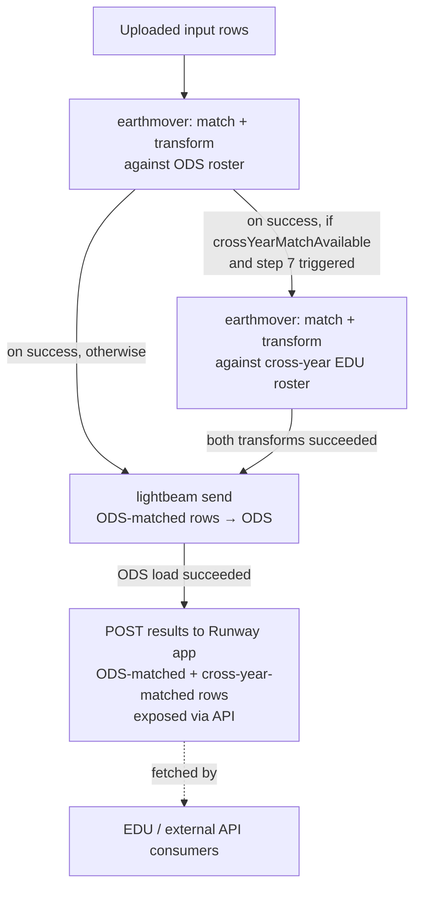

# Runway — AI Agent Context

> Context for AI coding assistants (Claude Code, Codex, Cursor, etc.). Update as the project evolves.

Runway is a UI for integrating K-12 education data to the [Ed-Fi](https://www.ed-fi.org/) standard, built on top of [earthmover](https://github.com/edanalytics/earthmover) (data transformation) and [lightbeam](https://github.com/edanalytics/lightbeam) (Ed-Fi API loading).

## Components

- **`app/`** — Node.js monorepo (NX workspace): NestJS backend + React frontend
- **`executor/`** — Python job executor (earthmover + lightbeam)
- **`cloudformation/`** — AWS deployment templates

## App Layout (`app/`)

```
app/
├── api/                # NestJS backend
│   ├── src/            # Application source
│   │   └── database/   # Prisma schema + Postgrator migrations
│   └── integration/    # Integration tests + helpers
├── fe/                 # React frontend
├── models/             # Shared TypeScript types
└── utils/              # Shared utilities
```

## Tech Stack

- **Frontend**: React 18, **Chakra UI v2** (custom tokens: `blue.50`, `pink.100`, `gray.50`, `green.100`), TanStack Router + Query, react-hook-form
- **Backend**: NestJS, Prisma ORM, PostgreSQL, Passport.js (OIDC for UI auth), [jose](https://github.com/panva/jose) (JWT for external API auth)
- **Build**: NX monorepo, TypeScript throughout `app/`
- **CI**: GitHub Actions — `.github/workflows/app_ci_pipeline.yml`

## Testing

### App tests (run from `app/`)

**Full suite — CI/local parity** (spins up a Dockerized test DB in CI and local runs):

```bash
npm run api:test
```

**Quick integration tests — local dev** (starts the test DB if needed, leaves it running):

```bash
npm run api:test:integration:local
```

**Unit tests** (no DB or Docker required):

```bash
npx nx test-unit api
```

Prefer integration tests; write a unit test only when integration tests can't practically reach the logic (e.g. code behind mocked AWS clients, like task-size selection in `executor.aws.service.spec.ts`). Unit tests are `*.spec.ts` files next to the code they test in `api/src/`, and must assert behavior that can really break — not just that mocks were called. Both suites run as part of `npm run api:test`.

**Typechecking:**

```bash
npm run api:typecheck
npm run fe:typecheck
```

## Database Migrations

Schema changes follow this workflow (all commands run from `app/`):

1. Write a SQL migration file in `app/api/src/database/postgrator/migrations/`
2. Present the SQL for review and get explicit user approval
3. Run `npm run api:migrate-local-dev` to apply the migration to the local dev DB
4. Run `npm run prisma:pull-and-generate` to introspect the DB and regenerate the Prisma schema + client
5. Verify the Prisma schema diff contains all and only the expected changes

**Do not edit `schema.prisma` directly** — it is generated from the database via `prisma:pull-and-generate`. The SQL migration is the source of truth.

The one exception is typing JSON columns with `prisma-json-types-generator`: add a `/// [TypeName]` line directly above the field, and declare `TypeName` in the `PrismaJson` namespace in `app/api/src/types/prisma.d.ts`. Re-introspection preserves these annotations on existing fields, so they survive `prisma:pull-and-generate`. Types shared with the frontend belong in `app/models`, aliased from `prisma.d.ts`.

Migrations run automatically at the start of the integration test suite. If tests fail with schema errors, a missing or mismatched migration is the likely cause.

## Architecture

### Deployed Infrastructure

- **App**: Elastic Beanstalk (EC2 + ALB), frontend on S3 + CloudFront
- **Executor**: ECS Fargate (3 task sizes: small/medium/large). The app picks the size per run: `medium` by default, `large` when the job's input files total at least `ECS_FILE_SIZE_THRESHOLD_MB` (default 100)
- **Database**: RDS PostgreSQL (private subnet)
- **Network**: VPC with public + private subnets across 2 AZs
- **CI/CD**: CodePipeline + CodeBuild → Beanstalk deploy + ECR push
- **Security**: WAF on ALB, IAM scoped roles, Secrets Manager
- **Monitoring**: CloudWatch dashboards + alarms, EventBridge → Slack via Lambda

### Job Execution Flow


```mermaid
sequenceDiagram
    participant User as Browser
    participant App as App (NestJS)
    participant DB as PostgreSQL
    participant S3 as AWS S3
    participant ECS as AWS ECS Fargate
    participant Exec as Executor (Python)
    participant ODS as Ed-Fi ODS API

    User->>App: POST /jobs (create job)
    App->>DB: Create Job + JobFile records
    App->>S3: Generate presigned upload URL
    App-->>User: { jobId, uploadLocations[] }

    User->>S3: PUT file (direct upload via presigned URL)

    User->>App: PUT /jobs/{id}/start
    App->>DB: Create Run record
    App->>ECS: RunTask (Fargate) with INIT_TOKEN, INIT_JOB_URL, AWS creds

    ECS->>Exec: Container starts
    Exec->>App: GET /api/earthbeam/jobs/{runId} (init handshake)
    App-->>Exec: Auth token + job definition (files, ODS creds, bundle, callback URLs)

    Exec->>ODS: lightbeam fetch (student roster)
    Exec->>S3: Download input files
    Exec->>Exec: earthmover run (transform data)
    Exec->>ODS: lightbeam send (load to ODS)
    Exec->>S3: Upload output artifacts
    Exec->>App: POST /output-files (path + sentToOds → app lists S3, saves run_output_file_set)

    Exec->>App: POST /status, /error, /summary, /unmatched-ids
    Exec->>App: POST /status {action: done}

    App->>S3: List output files → create RunOutputFile records

    User->>App: GET /jobs/{id}/output-files/{name}
    App->>S3: Generate presigned download URL
```

### AWS Dependencies

| Service | Used By | Purpose |
|---|---|---|
| **S3** | App + Executor | File storage — presigned upload/download URLs, executor artifact I/O |
| **ECS Fargate** | App | Launches executor container |
| **STS** | App | Generates scoped temporary credentials for executor S3 access |
| **SSM Parameter Store** | App | ECS cluster/subnet/task definition config |
| **Secrets Manager** | App | Database credentials, app config |
| **EventBridge** | App | Run-completion notifications (Slack, etc.) |
| **ECR** | CI/CD | Executor Docker image registry |

### Key Files — AWS Touchpoints

- `app/api/src/files/file.service.ts` — S3 presigned URL generation
- `app/api/src/earthbeam/executor/executor.aws.service.ts` — ECS task launch, STS assume role
- `app/api/src/event-emitter/event-emitter.service.ts` — EventBridge notifications
- `app/api/src/config/app-config.service.ts` — Secrets Manager + SSM reads

### Key Files — App ↔ Executor Communication

- `app/api/src/earthbeam/api/earthbeam-api.controller.ts` — HTTP callback endpoints the executor calls
- `app/api/src/earthbeam/api/earthbeam-api.service.ts` — Job payload assembly, run completion
- `app/api/src/earthbeam/api/idrs-credentials.service.ts` — IDRS OAuth token minting + per-partner cache
- `app/models/src/dtos/earthbeam-api.dto.ts` — Job payload shape
- `executor/executor/executor.py` — Main executor: S3 operations, HTTP callbacks, earthmover/lightbeam invocation

### Executor Lifecycle

1. **Init**: GET `INIT_JOB_URL` with `INIT_TOKEN` → receives auth token + job URL
2. **Job fetch**: GET job URL → full job definition (files, ODS creds, bundle, callback URLs)
3. **Bundle refresh**: git fetch/checkout/pull the earthmover bundle
4. **Roster fetch**: `lightbeam fetch` student roster from ODS, upload artifact to S3
5. **File download**: Download user-uploaded input files from S3
6. **Transform**: `earthmover run` against the ODS roster (with encoding detection + retry)
7. **Cross-year retry** (when `crossYearMatchAvailable` and the first pass produced unmatched students): GET `appUrls.roster` for the cross-year NDJSON roster, write to a `.jsonl` file, and re-run `earthmover` against it using the same ID type.
8. **Load**: `lightbeam send` to Ed-Fi ODS
9. **Report**: POST summary, unmatched IDs, errors to app via callback URLs
10. **Output files**: POST output file path + `sentToOds` flag to `/output-files` callback; app validates path, lists S3, saves `run_output_file_set`
11. **Done**: POST status `{action: DONE, status: success|failure}`

In the fuzzy matching modes the executor also calls `appUrls.identityService` immediately before using IDRS, exchanging its run-scoped bearer token for `{ token, url }`. See ID matching modes below. (Executor-side IDRS use is EDFIAL-481.)

### Cross-Year Matching Flow

When cross-year matching runs, the executor progresses through each stage of processing for both rosters before moving on, to avoid mixed-status jobs (e.g., a file failing "insufficient matches" against the ODS roster but succeeding against the cross-year roster, when those matches really belonged in the ODS).


```mermaid
flowchart TD
    Input[Uploaded input rows] --> T1[earthmover: match + transform<br/>against ODS roster]
    T1 -->|on success, if crossYearMatchAvailable<br/>and step 7 triggered| T2[earthmover: match + transform<br/>against cross-year EDU roster]
    T1 -->|on success, otherwise| Load
    T2 -->|both transforms succeeded| Load[lightbeam send<br/>ODS-matched rows → ODS]
    Load -->|ODS load succeeded| App[POST results to Runway app<br/>ODS-matched + cross-year-matched rows<br/>exposed via API]
    App -.fetched by.-> EDU[EDU / external API consumers]
```

Cross-year-matched rows are never sent to the ODS — they're only made available through the Runway app's API, which EDU and other external consumers query.

### Roster sources & no-ODS year selectability

A roster is the student lookup the executor matches input rows against. Source precedence:

1. **ODS** — for `sendToOds` years, the executor fetches the roster from the ODS API.
2. **EDU** — the cross-year roster from EDU (Snowflake), pulled via `appUrls.roster` as NDJSON when `crossYearMatchAvailable`. Two roles: for ODS years, it's the second-pass match for IDs that didn't match the ODS roster (see Cross-Year Matching Flow — those rows are never sent to the ODS); for no-ODS (`sendToOds=false`) years, it's the roster source, preferred over the S3 file (the executor handles this preference).
3. **S3 roster file** — the fallback for no-ODS years when cross-year matching is unavailable (`__rosters/...jsonl`). The app omits `rosterFilePath` from the payload when `crossYearMatchAvailable` is true (it would be a dangling pointer).

A no-ODS year is **selectable** at job creation, and shows **green** ("roster available") on the ODS-config page, when a roster file exists **OR** the partner has cross-year matching enabled. The executor payload's `crossYearMatchAvailable` is the same partner setting (`crossYearMatchingEnabled`) — there is no creds/connection check at run-prep time. The admin enable endpoint requires working EDU creds to turn the toggle on; once on, the EDU connection is an assumed dependency like postgres or S3: if EDU is unavailable mid-run, the run fails loudly at roster-fetch time rather than silently degrading to weaker matching. (In practice a tenant has either a roster file or an EDU connection, not both, so there is no fallback to preserve.)

All of this applies to the `id_based` and `id_based_fuzzy_background` modes. Pure `fuzzy` does no roster matching at all, so the payload carries neither roster source — but the existing no-ODS selectability gate is unchanged, so a no-ODS fuzzy job is still only creatable when a roster file exists or cross-year matching is enabled. Widening that is follow-on work.

### ID matching modes

How student identities are resolved is a per-partner setting, `id_matching_mode`, snapshotted onto each job at creation (`JobsService.createJob` writes it explicitly; the column default is migration safety only). Every run of a job uses that snapshot, so changing the partner setting affects only jobs created afterwards. There is no configuration UI yet.

| Mode | Authoritative path | Roster matching | `appUrls.identityService` / `appUrls.studentMatchResults` |
|---|---|---|---|
| `id_based` | Existing ID-based processing | ODS / EDU / S3 as above | absent |
| `id_based_fuzzy_background` | Existing ID-based processing | ODS / EDU / S3 as above | present |
| `fuzzy` | IDRS fuzzy matching | none — `appUrls.roster` and `rosterFilePath` are both omitted | present |

`crossYearMatchAvailable` still mirrors the live partner setting in every mode; in `fuzzy` it only tells the executor that IDRS results may span years.

**Credential handoff.** The payload never carries an IDRS token. The executor calls `GET /earthbeam/jobs/:runId/identity-service` with its run-scoped bearer token, which is the whole trust boundary: it names the run, hence the partner whose connection info may be returned. The callback deliberately has no mode check, no run-status check (background fuzzy work continues after the run reports `done`) and no one-call limit.

One IDRS service per deployment at `IDRS_URL`, with each partner addressed by request path and authenticated as its own OAuth client. The app loads that partner's `{ clientId, clientSecret }` from the `{ENVLABEL}-idrs-connection-info-{partnerId}` secret, uncached and bounded to 5s, then mints a client-credentials token from the shared `IDRS_OAUTH_TOKEN_URL` (one request, bounded to 5s) with `audience` set to `IDRS_URL` verbatim and `scope` of `student:identity:read partner:<partner-id>`. Locally, `IDRS_CLIENT_ID` / `IDRS_CLIENT_SECRET` stand in for the secret. Tokens are cached per partner per app instance while more than ten minutes of life remain; anything shorter or without a usable `expires_in` is returned but not cached. The `url` returned to the executor is the full student-search route — `IDRS_URL` plus `/partners/{partnerId}/tenants/{tenantCode}/students/search` — because the executor calls it as-is. `IDRS_URL` itself is never rewritten; it is also the OAuth audience, which must match verbatim.

Every failure is the same response, `500 identity_service_unavailable`: the executor only distinguishes 200 from non-200, so a finer taxonomy would have bought nothing it could act on. Diagnosis comes from the log line at the callback boundary (run id, partner id, elapsed time, upstream error name or status); credentials, tokens, OAuth bodies and the callback response are never logged. `AppConfigService.getIdrsConnectionInfo` follows the adjacent EDU getter — null for missing or malformed config, real AWS failures thrown.

Rollout order: set `IDRS_OAUTH_TOKEN_URL` and `IDRS_URL` and deploy an executor that implements EDFIAL-481, both once per deployment; then, per partner, provision the secret and change the partner's mode. There is no enable-time preflight — an `id_based` executor calling the unadvertised callback gets a `500` and a `no IDRS connection info for partner <id>` log, which is expected and harmless.

The executor step is a hard prerequisite, not an ordering preference. An executor that predates EDFIAL-481 ignores `idMatchingMode` and `appUrls.identityService` entirely, so a partner switched to either fuzzy mode gets the old roster-based path against a payload built for the new one: pure fuzzy omits both roster sources the old executor unconditionally reads. Deploying the app itself is safe at any time while every partner is still `id_based`.

The config and secret steps are owned by the cloud engineering team and happen outside this repo: neither `IDRS_OAUTH_TOKEN_URL` nor `IDRS_URL` is threaded through `cloudformation/` (unlike `OAUTH2_ISSUER` or `UM_CONFIG_SECRET`), and the per-partner `{ENVLABEL}-idrs-connection-info-{partnerId}` secrets are provisioned directly. Don't add the stack wiring here — coordinate with cloud eng instead.

#### Student match results

The Executor posts IDRS match results — each group of input details with the suggestions IDRS returned for it — to `POST /api/earthbeam/jobs/:runId/student-match-results` (`StudentMatchResultsService`), advertised as `appUrls.studentMatchResults` alongside the identity service. Today it sends only students IDRS could not resolve. Sending auto-matched students too would need a way to record the automatic resolution; otherwise they would look like students awaiting review. It is unrelated to the older `unmatchedIds` callback.

The body is a JSON array of `EarthbeamApiStudentMatchResultDto` (`app/models`): a `correlation_id` (opaque, 1–128 characters), a `candidate` object of input details, and a possibly empty `matches` array whose entries carry a `student_unique_id`, a numeric `score` and roster details. It is stored exactly as sent, with unknown keys kept and nothing normalized, so fields IDRS adds later are already stored when the app starts using them, and malformed details — which may be why a record needs review — survive verbatim.

Three tables hold it: `student_input_details`, keyed by `(job_id, correlation_id)`; `student_match_result`, one row per input group per run, present even when the run found no suggestions; and `student_match_suggestion`, keyed by `(result_id, ordinal)`, a position within a result rather than a student identity. Job, partner and tenant come from the authenticated run, never the body, and composite `(run_id, job_id)` foreign keys enforce it.

**Validation.** The DTO checks the shape, and the columns the fields land in back it up. One rule is the DTO's alone: that `matches` is an array, since the array lands in no column; without the check, a missing `matches` would be stored as "IDRS found nothing". Any rejection rolls back the whole request.

**Duplicate correlation ids** within a request aren't checked: the DTO can't see across records, and the Executor sends one entry per correlation id. If it ever sent duplicates, a shared id means the same input and therefore the same matches. Duplicates without matches collapse into one input row and one result. Duplicates with matches collide on the suggestion primary key, so the request fails with nothing written. Stored data could be wrong only if a correlation id were attached to the wrong input or matches at the source, which the app doesn't guard against.

| Status | Meaning |
|---|---|
| 201 | Stored, or a retry that changed nothing. Empty body. The same as the other Executor callbacks, one of which the Executor checks for exactly 201 |
| 400 | The body doesn't match the DTO. `message` names each failing record by index and rule, e.g. `[3] matches must be an array`, never a value. The app doesn't log 400s, so the Executor should log this body |
| 401 / 403 | Missing token, or a token for a different run |
| 404 | No such run |
| 413 | Body over the JSON parser limit: Nest's default, pending the agreed cap (below) |
| 500 | The database rejected the payload, or persistence failed. Nothing was written. The app logs the SQLSTATE, never the message, since a constraint violation's detail quotes the failing row. A payload containing a NUL character (`\u0000`) always lands here, since PostgreSQL's `jsonb` cannot store one; retrying the same bytes fails the same way |

**Retries and runs.** A retry re-sends exactly what was already sent; the Executor never re-queries IDRS for a group it has reported. So a retry is a no-op: the first report of a group wins, and nothing stored is rewritten. A job's first run is the one that extracts input details and calls IDRS, so it establishes every input row. Results are keyed by run so that a later search of the same input, such as rematching (not yet built), adds history rather than overwriting it.

Each request is one transaction, for atomicity: a failure between the three inserts would otherwise leave a result with no suggestions, which looks like a genuine no-match and which a retry cannot repair. No row lock is taken: every insert is `ON CONFLICT DO NOTHING` against a unique key, so overlapping requests, such as a timed-out retry racing its original, still store one consistent dataset.

This endpoint never changes run state; acting on a failure is the Executor's job. In `fuzzy` it fails the run; in `id_based_fuzzy_background` it stops only the background processing. That mode is watched through app and Executor logs, with no background-failure UI.

**Outstanding:** the request byte limit is not yet set. The endpoint currently runs under Nest's default JSON parser, so a large batch is rejected by that default rather than by an agreed limit. Confirm the cap and any record cap with cloud engineering and the Executor, then register a route-scoped parser for this route only — check the `SizeRestrictions_BODY` rule in `cloudformation/templates/0-waf.yml` against deployed behavior rather than assuming the app-side constant is sufficient.

### S3 Path Structure

```
{partnerId}/{tenantCode}/{schoolYearId}/{jobId}/input/{templateKey}__{fileName}
{partnerId}/{tenantCode}/{schoolYearId}/{jobId}/output/{artifactFileName}
__rosters/{partnerId}/{tenantCode}/{schoolYearEndYear}/*
```

## Development Conventions

- **Commits**: lowercase subject + body explaining the "why"
- **API**: NestJS controller → service. Services use Prisma directly, including for transactions and raw SQL; there is no separate repository layer
- **Error handling**: Services return result objects (`{ status: 'SUCCESS', data }` / `{ status: 'ERROR', code }`) for expected failure modes; unexpected errors throw. Controllers map error results to HTTP exceptions. Services should not import or throw HTTP exceptions.
- **FE**: Chakra UI v2 with custom design tokens; prefer inline readable code over extracted helpers for short logic
- **Icons**: `app/fe/src/assets/icons/`
- **Data fetching and suspense**:
  - Critical data → `useSuspenseQuery` in the component, `ensureQueryData` in an ancestor loader.
  - Optional data → `useQuery` with a fallback value. Optionally `prefetchQuery` in a loader to warm the cache.
  - Never `useSuspenseQuery` on a query only reached via `prefetchQuery` — a failed prefetch will re-suspend.
  - Scope prefetches to the route that needs them, not `__root`.
  - Always `await` or `return` a prefetch from the loader — fire-and-forget won't warm the cache in time. Pair `prefetchQuery` with a soft fallback (`data ?? default`) in the component, since errored prefetches leave the cache empty.
  - Per-major-route pending/error UI via TanStack Router's `pendingComponent` and `errorComponent` (set on the section's parent route, e.g., `/ods-configs`). Route-level pending covers all sub-routes; the top-level React `<Suspense>` in `app.tsx` is only a safety net for unexpected suspends.
- **Documentation**: When changing behavior described in nearby docs (README.md, AGENTS.md, code comments), update the docs in the same commit. When creating a commit, review changed files for references to documentation and flag any that may need updating.
